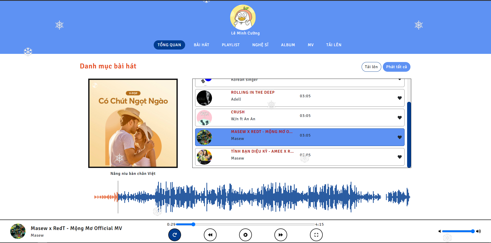

# Mucsic App Using Vue 3 bản official

Sử dụng ngôn ngữ Vue 3 đơn thuần để viết.

## Chức năng

-   Loop nhạc
-   Chọn nhạc
-   Chọn bài trước đó / sau đó
-   Dừng nhạc
-   Zoom to/ Zoom bé
-   Chỉnh sửa âm thanh
-   Animation lúc bấm play nhạc

## Demo Online [Link](https://ram4gb.github.io/Music_Player_Vue3/#/)

## Kết quả

## Cách chạy

Bước 1:
`npm i`

Bước 2:
`npm run serve`

Bước 3:
Mở http://localhost:8080/

Ghi chú: Đồ án môn Các công nghệ lập trình hiện đại.

**Đang update branch production để ra bản official**
