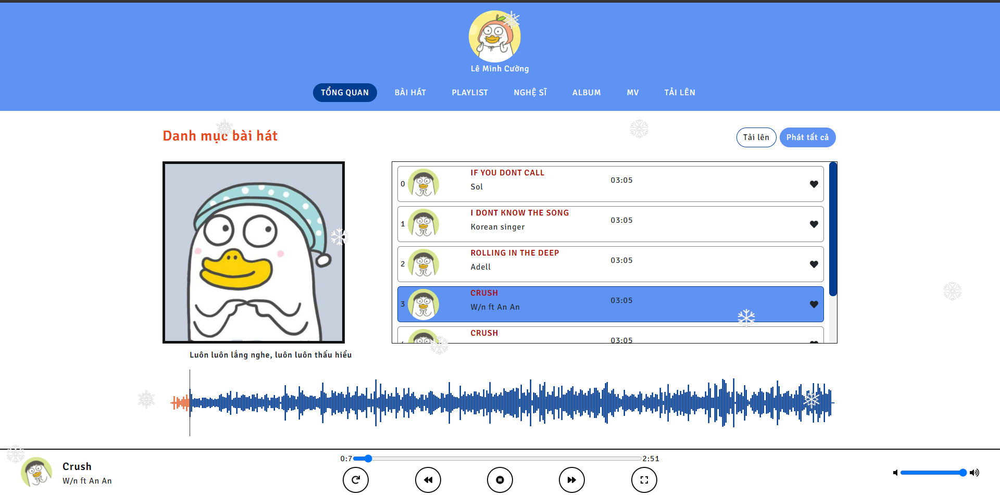

# Mucsic App Using Vue 3 bản meme

Sử dụng ngôn ngữ Vue 3 đơn thuần để viết.

## Chức năng

-   Loop nhạc
-   Chọn nhạc
-   Chọn bài trước đó / sau đó
-   Dừng nhạc
-   Zoom to
-   Chỉnh sửa âm thanh

## Kết quả

Ghi chú: Đồ án môn Các công nghệ lập trình hiện đại.

**Đang update branch production để ra bản official**
